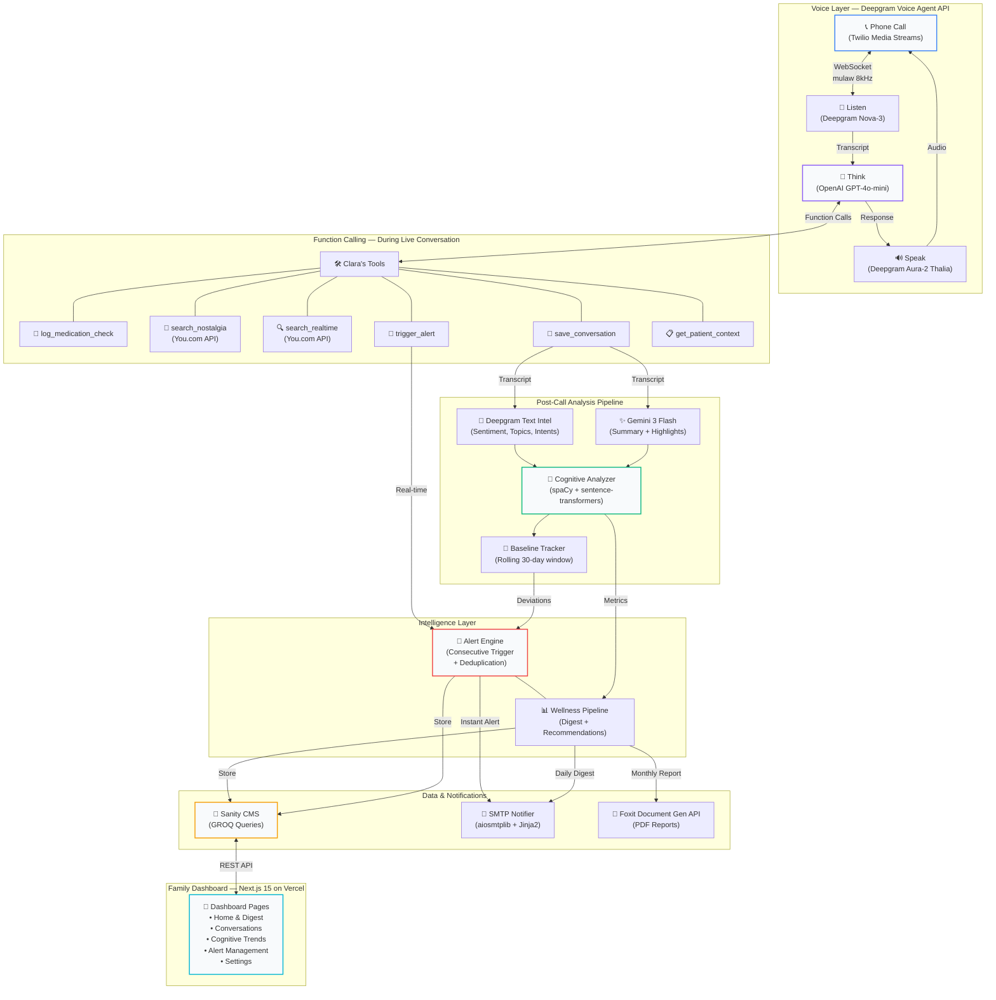
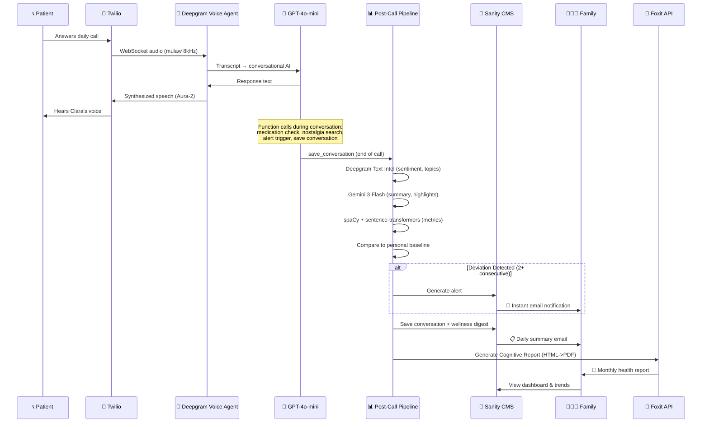

<p align="center">
  
</p>

<h1 align="center">ClaraCare</h1>

<p align="center">
  <strong>AI Voice Companion for Early Cognitive Decline Detection in Elderly Adults</strong>
</p>

<p align="center">
  <a href="#-how-it-works">How It Works</a> •
  <a href="#-architecture">Architecture</a> •
  <a href="#-key-features">Features</a> •
  <a href="#-tech-stack">Tech Stack</a> •
  <a href="#-getting-started">Getting Started</a> •
  <a href="#-project-structure">Structure</a>
</p>

---

## 💡 The Problem

We live in a fast-paced world. Our generation is constantly on the move, juggling demanding careers, young families, and relentless schedules. Yet, our most quietly pervasive worry is often miles away: our aging parents.

Over 40% of seniors experience chronic loneliness, but statistics don't capture the daily guilt of an adult child who realizes it's been three days since they called home. We know AI will never replace a child's love, nor can it replace human medical care. If someone is having a genuine medical issue, human intervention is the only answer.

But what about the days in between? What about the mundane Tuesday mornings?

We built ClaraCare not as a caretaker replacement, but as a bridge, a way for our generation to keep a gentle, loving, daily pulse on our parents amidst our busy lives. A tool to ensure they never feel forgotten, and to give us the peace of mind that today, Mom is doing just fine.

## 🎯 What ClaraCare Does

ClaraCare is an **AI-powered voice companion** named Clara that calls elderly adults daily for warm, natural check-in conversations. Behind every call, a cognitive analysis engine silently tracks linguistic biomarkers over time — vocabulary diversity, topic coherence, repetition patterns, response latency — and alerts family members the moment something changes.

**Clara doesn't feel like a medical tool.** She feels like a friend calling to chat about the garden, the grandkids, or what's for lunch. But under the hood, every conversation builds a longitudinal cognitive profile that can detect decline months before traditional screening.

---

## 🔬 How It Works

```
📞 Clara calls Mark every morning
    ↓
🗣️ They chat about his day, meals, medications
    ↓
🧠 NLP engine analyzes vocabulary, coherence, pauses, sentiment
    ↓
📊 Metrics compared against Mark's personal baseline
    ↓
🚨 Family gets alerts if patterns deviate
    ↓
📋 Daily wellness digest emailed to family members
    ↓
📄 Monthly cognitive health report generated as a PDF
```

Every conversation generates a **cognitive fingerprint** — a snapshot of how the patient's language patterns compare to their own baseline. ClaraCare doesn't compare against population averages; it learns each patient's normal and watches for their changes.

---

## 🏗️ Architecture



### Data Flow: From Phone Call to Family Alert



---

## ✨ Key Features

### 🗣️ Natural Voice Conversations
Clara speaks with warmth and patience through the **Deepgram Voice Agent API**. She remembers what the patient talked about yesterday, asks about their garden, and gently checks if they took their medications. The conversation feels human — not clinical.

### 🧠 Cognitive Biomarker Tracking
Every conversation is analyzed across **5 key linguistic dimensions** using spaCy and sentence-transformers:

| Metric | What It Measures | Why It Matters |
|--------|-----------------|----------------|
| **Vocabulary Diversity** | Range of unique words used | Shrinking vocabulary is an early dementia indicator |
| **Topic Coherence** | How smoothly topics flow | Sudden jumps may signal confusion |
| **Repetition Rate** | Frequency of repeated stories/phrases | Increased repetition suggests memory difficulty |
| **Word-Finding Pauses** | Hesitations while searching for words | More pauses can indicate cognitive strain |
| **Response Latency** | Time to respond to questions | Slower processing may reflect cognitive changes |

### 📊 Personal Baseline Tracking
ClaraCare builds a **personal cognitive baseline** from each patient's first 7+ conversations, then monitors deviations from *their* normal using a rolling 30-day window. No generic population benchmarks.

### 🚨 Intelligent Alert System
Alerts only fire after **2+ consecutive conversations** show deviation, reducing false positives. Each alert includes:
- A warm, non-clinical description of what changed
- A specific suggested action for the family
- Severity classification (Low / Medium / High)
- Deduplication — same alert type won't fire twice until acknowledged

### 📋 Daily Wellness Digest
Families receive a formatted email digest after each call with:
- Conversation summary in warm, family-friendly language
- Mood assessment and conversation highlights
- Medication adherence tracking
- Actionable recommendations

### 📄 Comprehensive Cognitive Health Reports
Families can download beautiful PDF reports generated via **Foxit PDF Services APIs**. The reports map long-term cognitive trends and include an executive summary authored by **Gemini 3 Flash**.

### 🎵 Nostalgia Mode
Using the **You.com Search API**, Clara can find music, news, and cultural references from the patient's "golden years" (ages 15–25) to spark engaging conversations and stimulate long-term memory recall.

### 📱 Family Dashboard
A Next.js 15 dashboard (deployed on Vercel) where family members can:
- View conversation history with mood indicators
- Track cognitive trends over time with interactive charts
- Manage alerts (unreviewed alerts surface first)
- Configure notification preferences and download Foxit-generated reports

---

## 🛠️ Tech Stack

| Layer | Technology | Purpose |
|-------|-----------|---------|
| **Phone** | Twilio Media Streams | Inbound/outbound calls via WebSocket |
| **Voice Agent** | Deepgram Voice Agent API | End-to-end voice pipeline (listen → think → speak) |
| **STT** | Deepgram Nova-3 | Speech-to-text transcription |
| **Conversation AI** | OpenAI GPT-4o-mini | Clara's persona, function calling, dialogue |
| **TTS** | Deepgram Aura-2 (Thalia) | Natural text-to-speech voice |
| **Post-Call Summary** | Google Gemini 3 Flash | Conversation summarization & wellness highlights |
| **NLP** | spaCy + sentence-transformers | Cognitive metric extraction (vocab, coherence, etc.) |
| **Text Analysis** | Deepgram Text Intelligence | Sentiment analysis, topic detection, intent recognition |
| **Database** | Sanity CMS (GROQ) | Structured content store with real-time queries |
| **Email** | aiosmtplib + Jinja2 | Alert & digest email delivery |
| **Search** | You.com API | Nostalgia mode & real-time information retrieval |
| **PDF Reports** | Foxit Document Generation API | Dynamically creates health reports for families |
| **Dashboard** | Next.js 15 + Tailwind CSS | Family-facing web application |
| **Backend** | FastAPI (Python 3.11+) | REST API & WebSocket server |
| **Deployment** | Docker + Kubernetes (Linode LKE) | Production backend hosting |
| **Frontend Hosting** | Vercel | Dashboard auto-deploy from git |

---

## 📁 Project Structure

```
clara-care/
├── backend/                    # FastAPI backend
│   ├── app/
│   │   ├── main.py             # Application entry point & API routes
│   │   ├── voice/              # Voice agent layer
│   │   │   ├── agent.py        # Deepgram Voice Agent WebSocket handler
│   │   │   ├── functions.py    # 6 function call handlers (meds, nostalgia, alerts, etc.)
│   │   │   ├── outbound.py     # Initiating calls via Twilio
│   │   │   └── persona.py      # Clara's personality prompt & greeting
│   │   ├── cognitive/          # Post-call cognitive analysis
│   │   │   ├── analyzer.py     # spaCy + sentence-transformers linguistic analysis
│   │   │   ├── pipeline.py     # End-to-end analysis orchestrator
│   │   │   ├── baseline.py     # Personal baseline tracking (rolling 30-day window)
│   │   │   ├── alerts.py       # Alert engine (consecutive triggers + dedup)
│   │   │   └── post_call_analyzer.py  # Deepgram Text Intel + Gemini summary
│   │   ├── reports/            # PDF Generation
│   │   │   ├── generator.py    # Health report PDF generation engine
│   │   │   └── foxit_client.py # Integration with Foxit APIs
│   │   ├── nostalgia/          # You.com-powered nostalgia engine
│   │   ├── storage/
│   │   │   └── sanity.py       # Sanity CMS client (GROQ queries + mutations)
│   │   └── notifications/
│   │       ├── email.py        # SMTP email sender (aiosmtplib)
│   │       └── templates/      # Jinja2 email templates (digest, alerts)
│   ├── scripts/                # Migration & utility scripts
│   ├── tests/                  # Test suite
│   └── Dockerfile
├── dashboard/                  # Next.js 15 family dashboard
│   └── src/
│       ├── app/
│       │   ├── page.tsx        # Landing page
│       │   └── dashboard/      # Dashboard routes (home, history, trends, alerts)
│       ├── components/         # React components (AlertCard, DigestPanel, etc.)
│       └── lib/                # API client, utilities, types
├── studio-claracare/           # Sanity Studio (CMS admin)
│   └── schemaTypes/            # Content schemas (patient, conversation, alert, wellnessDigest)
├── k8s/                        # Kubernetes deployment manifests
└── docs/                       # Documentation
```

---

## 🚀 Getting Started

### Prerequisites
- Python 3.11+
- Node.js 18+
- Docker (for deployment)

### 1. Clone & Install

```bash
git clone https://github.com/rajeev-chaurasia/clara-care.git
cd clara-care/backend

python3 -m venv venv
source venv/bin/activate
pip install -r requirements.txt
```

### 2. Configure Environment

```bash
cp .env.example .env
```

Required API keys:
- `DEEPGRAM_API_KEY` — Voice agent (STT, TTS, and conversational AI)
- `OPENAI_API_KEY` — GPT-4o-mini for conversation (via Deepgram Voice Agent)
- `GEMINI_API_KEY` — Post-call summarization & highlights
- `TWILIO_ACCOUNT_SID`, `TWILIO_AUTH_TOKEN` — Phone calls
- `SANITY_PROJECT_ID`, `SANITY_DATASET`, `SANITY_TOKEN` — Database
- `SMTP_HOST`, `SMTP_PORT`, `SMTP_USER`, `SMTP_PASSWORD` — Email notifications
- `FOXIT_API_KEY` — PDF report generation
- `YOUCOM_API_KEY` — Nostalgia mode & real-time search

### 3. Run the Backend

```bash
python3 -m app.main
```

Server starts at `http://localhost:8000`. For Twilio webhooks, expose via ngrok:

```bash
ngrok http 8000
```

### 4. Run the Dashboard

```bash
cd ../dashboard
npm install
npm run dev
```

Dashboard available at `http://localhost:3000`.

### 5. Deploy to Production

```bash
# Build & push backend
docker build --platform linux/amd64 -t your-registry/claracare-backend:latest backend/
docker push your-registry/claracare-backend:latest

# Deploy to Kubernetes
kubectl apply -f k8s/
```

---

## 📚 Documentation

| Document | Description |
|----------|-------------|
| [Project Overview](docs/00-PROJECT-OVERVIEW.md) | Product vision & market fit |
| [Architecture](docs/02-ARCHITECTURE.md) | Detailed system design |
| [API Setup](docs/05-API-SETUP.md) | Getting your API keys |
| [Sanity CMS](docs/SANITY-SETUP.md) | Database schema & setup |
| [You.com Integration](docs/YOUCOM-SETUP.md) | Search & Nostalgia APIs |

---
