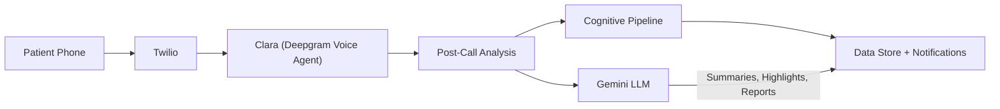
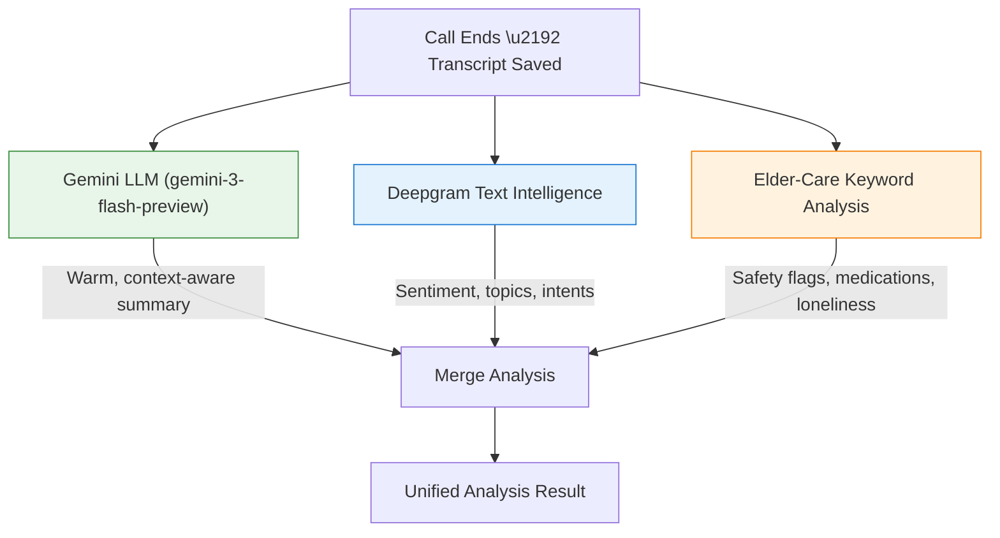
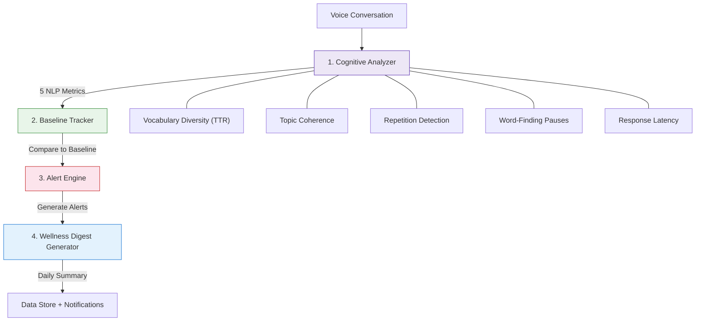

# ClaraCare Backend

AI voice companion for elderly care — phone-based daily check-ins with Clara, featuring cognitive analysis and family notifications.

## Overview

ClaraCare provides a complete cognitive health monitoring system:
- **Voice Agent** — Natural phone conversations with Clara via Deepgram Voice Agent API
- **Gemini LLM Intelligence** — Context-aware call summaries, wellness highlights, and PDF executive summaries via `gemini-3-flash-preview`
- **Cognitive Analysis Engine** — NLP-based metrics, baseline tracking, alerts, and wellness digests
- **Deepgram Text Intelligence** — Sentiment analysis, topic detection, and intent recognition
- **Nostalgia Engine** — You.com-powered era-specific content for patient engagement
- **Data Layer** — Sanity CMS for persistent patient data and conversation storage
- **Reports** — Foxit Document Generation for cognitive health PDFs with Gemini executive summaries
- **Notifications** — Automated email alerts to family members

## Quick Start

### 1. Install Dependencies

```bash
cd backend
pip install -r requirements.txt
```

### 2. Download NLP Models

```bash
python -m spacy download en_core_web_sm
```

### 3. Configure Environment

Copy `.env.example` to `.env` and fill in your API keys:

```bash
cp .env.example .env
```

### 4. Run Server

```bash
python3 -m app.main
```

Server runs at `http://localhost:8000` with API docs at `/docs`.

## Architecture



### Post-Call Analysis Flow



### Voice Agent
Natural phone conversations powered by Deepgram's Voice Agent API with Twilio for telephony. Clara can have open-ended conversations, remind about medications, share nostalgia and news, detect distress, and save conversation summaries with cognitive analysis.

### Cognitive Analysis Pipeline



### Gemini LLM Integration

Gemini (`gemini-3-flash-preview`) is used across the pipeline for:

| Component | Usage |
|-----------|-------|
| **Post-Call Summary** | Generates warm, family-friendly summaries with patient context |
| **Wellness Highlights** | Creates detailed KEY HIGHLIGHTS for dashboard and email |
| **PDF Executive Summary** | Writes narrative cognitive health overview for downloadable reports |

## File Structure

```
backend/
├── app/
│   ├── main.py                      # FastAPI application entry point
│   ├── voice/                       # Voice Agent
│   │   ├── agent.py                 # Deepgram Voice Agent integration
│   │   ├── functions.py             # Clara's callable functions
│   │   ├── persona.py               # Clara's personality and system prompt
│   │   ├── twilio_bridge.py         # Twilio WebSocket handler
│   │   └── outbound.py              # Outbound call manager
│   │
│   ├── cognitive/                   # Cognitive Analysis
│   │   ├── models.py                # Pydantic models
│   │   ├── analyzer.py              # 5 NLP metrics engine
│   │   ├── post_call_analyzer.py    # Gemini + Deepgram + elder-care analysis
│   │   ├── baseline.py              # Baseline tracking and deviation detection
│   │   ├── alerts.py                # Alert generation
│   │   ├── pipeline.py              # Orchestrator (chains all analysis steps + Gemini highlights)
│   │   └── utils.py                 # Shared utilities
│   │
│   ├── nostalgia/                   # You.com nostalgia engine
│   │   └── youcom_client.py         # You.com API client
│   │
│   ├── storage/                     # Data layer
│   │   ├── base.py                  # DataStore protocol
│   │   ├── memory.py                # In-memory implementation
│   │   └── sanity.py                # Sanity CMS implementation
│   │
│   ├── reports/                     # Report generation
│   │   ├── foxit_client.py          # Foxit Document Generation API
│   │   └── generator.py             # Report builder + Gemini executive summary
│   │
│   ├── notifications/               # Email system
│   │   ├── email.py                 # Async SMTP + Jinja2 templates
│   │   └── templates/               # Email HTML templates
│   │
│   └── routes/                      # REST API
│       ├── patients.py              # GET /api/patients/{id}
│       ├── conversations.py         # GET /api/conversations
│       ├── wellness.py              # GET /api/wellness-digests
│       ├── alerts.py                # GET /api/alerts
│       ├── insights.py              # GET /api/insights
│       └── reports.py               # GET /api/reports
│
├── tests/                           # Test suite
├── requirements.txt
├── .env.example
└── README.md
```

## API Endpoints

### Voice
| Method | Endpoint | Description |
|--------|----------|-------------|
| `GET` | `/health` | Server status |
| `POST` | `/voice/call/patient` | Clara calls a patient |
| `GET` | `/voice/calls` | List active calls |
| `WS` | `/voice/twilio` | Twilio media stream |

### Patients
| Method | Endpoint | Description |
|--------|----------|-------------|
| `GET` | `/api/patients/{patient_id}` | Patient profile + baseline |
| `PATCH` | `/api/patients/{patient_id}` | Update patient preferences |

### Conversations
| Method | Endpoint | Description |
|--------|----------|-------------|
| `GET` | `/api/conversations?patient_id={id}` | List conversations |
| `GET` | `/api/conversations/{id}` | Full conversation details |

### Wellness & Cognitive
| Method | Endpoint | Description |
|--------|----------|-------------|
| `GET` | `/api/wellness-digests?patient_id={id}` | Wellness digests |
| `GET` | `/api/wellness-digests/latest?patient_id={id}` | Latest digest |
| `GET` | `/api/cognitive-trends?patient_id={id}&days=30` | Time-series data |

### Alerts
| Method | Endpoint | Description |
|--------|----------|-------------|
| `GET` | `/api/alerts?patient_id={id}&severity=high` | List alerts |
| `PATCH` | `/api/alerts/{alert_id}` | Acknowledge alert |

### Reports & Insights
| Method | Endpoint | Description |
|--------|----------|-------------|
| `GET` | `/api/insights/{patient_id}` | Cognitive insights |
| `GET` | `/api/reports/{patient_id}/cognitive-report` | Generate PDF report |

## Deployment

The backend is deployed on Akamai LKE with Cloudflare TLS termination.

- **URL**: `https://api.claracare.me`
- **Docker Image**: `rajeevdev17/claracare-backend:latest`

**Requirements:**
- Python 3.11+
- Public HTTPS endpoint for Twilio webhooks
- SMTP access for email notifications (optional)

## Design Decisions

1. **Protocol-based storage** — `DataStore` protocol allows easy swapping between in-memory, Sanity, or other backends
2. **Lazy model loading** — NLP models loaded on first use to avoid slow startup
3. **Async-first** — All I/O operations are async for performance
4. **Composable pipeline** — Each stage (analyze → baseline → alert → digest) is independent and testable
5. **Graceful degradation** — System works even if Gemini/NLP models fail (returns rule-based fallbacks)
6. **Email client compatibility** — Table-based layouts with gradient fallbacks
7. **Gemini-first summarization** — Warm, family-friendly summaries via `gemini-3-flash-preview` with full patient context, replacing Deepgram's generic output